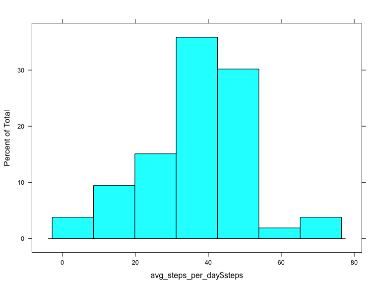
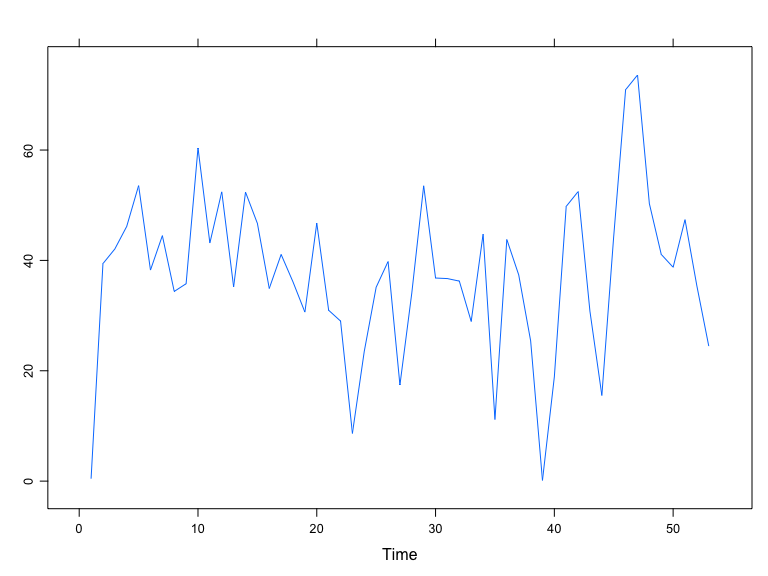

# Reproducible Research: Peer Assessment 1


## Loading and preprocessing the data


```r
# load the lattice library
library(lattice)

# set the url
url = "https://d396qusza40orc.cloudfront.net/repdata%2Fdata%2Factivity.zip"

# set the destination file
destfile = "activity.zip"

# set the method to curl as it's https we are getting
method = "curl"

# download the file
# download.file(url, destfile, method, quiet = FALSE, mode = "w",
#               cacheOK = TRUE,
#               extra = getOption("download.file.extra"))

# unzip it
unzip(destfile)

# read in the CSV
data = read.csv("activity.csv")
```


```r
# disgard the NA values for this
no_missing_data <- data[!is.na(data$steps), ]

# aggregate the steps over days
avg_steps_per_day = aggregate(steps ~ date , data = data, FUN = mean, na.rm = TRUE)
```

## What is mean total number of steps taken per day?

### make a histogram of the number of steps


```r
histogram(avg_steps_per_day$steps)
```

 

### the mean and median steps per day


```r
# calculate the mean 
steps_mean = mean(avg_steps_per_day$steps)

# calculate the median
steps_median = median(avg_steps_per_day$steps)
```

Calculated Mean of steps: 37.3825996

Calculated Median of steps: 37.3784722

## What is the average daily activity pattern?

. The time series plot of the 5-minute interval


```r
xyplot(ts(avg_steps_per_day$steps))
```

 

Which 5-minute interval, on average across all the days in the dataset, contains the maximum number of steps?

73.5902778

## Imputing missing values


## Are there differences in activity patterns between weekdays and weekends?
