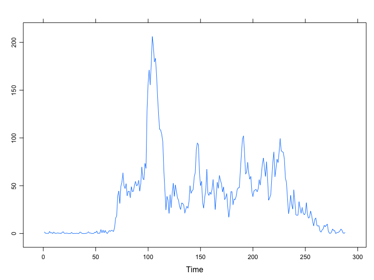
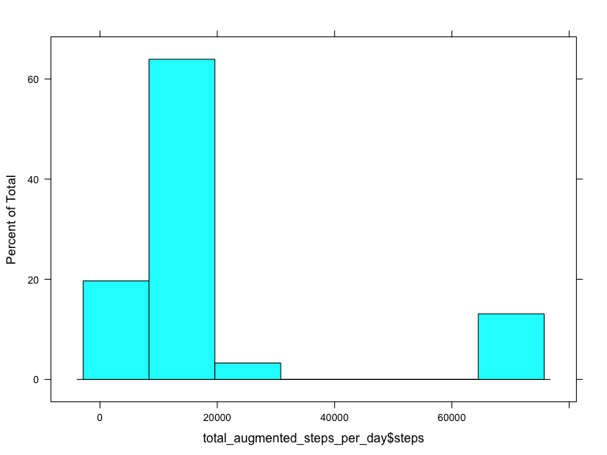
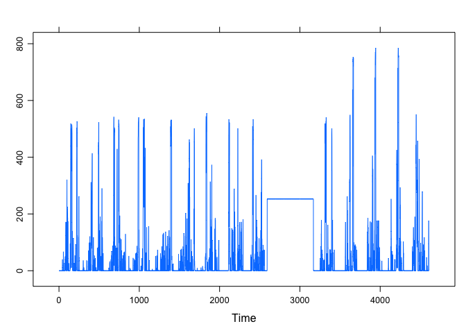
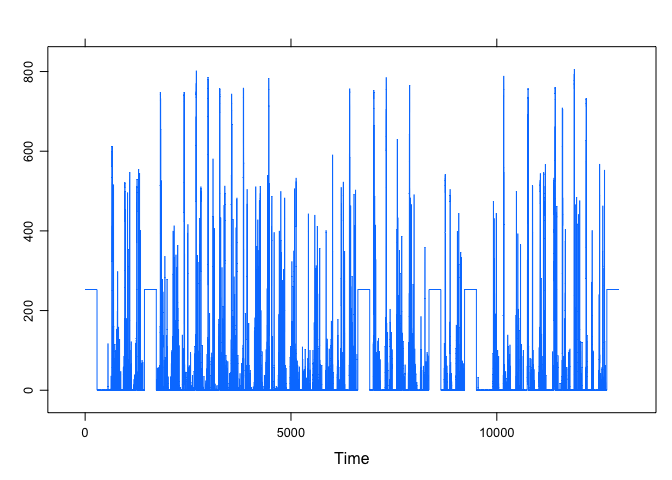

# Reproducible Research: Peer Assessment 1


## Loading and preprocessing the data


```r
# load the lattice library
library(lattice)

# set the url
url = "https://d396qusza40orc.cloudfront.net/repdata%2Fdata%2Factivity.zip"

# set the destination file
destfile = "activity.zip"

# set the method to curl as it's https we are getting
method = "curl"

# download the file
# download.file(url, destfile, method, quiet = FALSE, mode = "w",
#               cacheOK = TRUE,
#               extra = getOption("download.file.extra"))

# unzip it
unzip(destfile)

# read in the CSV
data = read.csv("activity.csv")
```


```r
# aggregate the total steps over days, disregarding NAs
total_steps_per_day = aggregate(steps ~ date , data = data, FUN = sum, na.rm = TRUE)

# aggregate the total steps over intervals, disregarding NAs
total_steps_per_interval = aggregate(steps ~ interval , data = data, FUN = mean, na.rm = TRUE)
```

## What is mean total number of steps taken per day?


```r
total_steps_per_day_mean = mean(no_missing_data$steps)
```

Mean total steps per day: 37.3825996

### make a histogram of the number of steps


```r
histogram(total_steps_per_day$steps)
```

 

### the mean and median steps per day


```r
# calculate the mean 
avg_steps_mean = mean(total_steps_per_day$steps)

# calculate the median
avg_steps_median = median(total_steps_per_day$steps)
```

Calculated Mean of average steps per day: 1.0766189\times 10^{4}

Calculated Median of average steps per day: 10765

## What is the average daily activity pattern?

The time series plot of the 5-minute interval


```r
xyplot(ts(total_steps_per_interval$steps))
```

 

Which 5-minute interval, on average across all the days in the dataset, contains the maximum number of steps?


`r `

## Imputing missing values

1. The number of missing values in the dataset:


```r
# find the missing values and count them
total_missing_steps = length(which(is.na(data$steps)))
```

The data has: 2304 missing values.

2. Strategy for filling missing values:


```r
# take the 95th percentile of the good data and use that to substitute out the missing data
steps_95th = quantile(no_missing_data$steps, 0.95)
```

3. Creating a new data set with the NA steps filled in:


```r
# get a data set for augmentation
augmented_data = data

# substitude that into the missing data steps
augmented_data$steps[is.na(augmented_data$steps)] <- steps_95th

total_augmented_steps_per_day = aggregate(steps ~ date, data = augmented_data, FUN = sum)
```

4. Histogram with Mean and Median calculations:


```r
histogram(total_augmented_steps_per_day$steps)
```

 


```r
# mean calculation
augmented_mean = mean(total_augmented_steps_per_day$steps)

# meadian
augmented_median = mean(total_augmented_steps_per_day$steps)
```

Mean for augmented data: 1.8904498\times 10^{4}

Median for augmented data: 1.8904498\times 10^{4}


## Are there differences in activity patterns between weekdays and weekends?

1. Get a new vector that has a weekend or weekday


```r
wdata = augmented_data

wdata$wend <- as.factor(ifelse(weekdays( as.Date(data$date)) %in% c("Saturday","Sunday"), "Weekend", "Weekday"))
```

2. Plot them:


```r
xyplot(ts(wdata[wdata$wend == "Weekend", ]$steps))
```

 

```r
xyplot(ts(wdata[wdata$wend == "Weekday", ]$steps))
```

 

